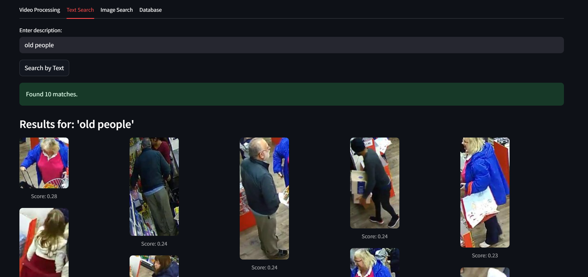

# Look Out

An AI-powered human detection and search system for emergency response and public safety.

## Project Overview

Look Out is designed to assist local government officials in rapidly identifying and locating individuals from video footage. The system processes surveillance videos to detect humans, creates a searchable database of detected individuals, and allows for searching by text descriptions or image uploads.

## Project Demo

### Screenshots



*Screenshot of the Look Out interface showing human detection results*

### Video Demo

A complete demonstration of the project is available in the demo video:

[Watch the Demo Video](./demo.mp4)

## Team: Code Sentinels
- Uday Kalyan Nuthalapati - Master's in Computer Science
- Gnana Lekhana Agerisetti - Master's in Computer Science
- Sindhu Yadulla - Master's in Computer Science
- Parth Bhanderi - Master's in Artificial Intelligence
- Shiny Kota - Master's in Artificial Intelligence

## Installation

### Prerequisites
- Python 3.8 or higher
- CUDA-compatible GPU (recommended for faster processing)
- Qdrant vector database

### Step 1: Clone the repository
```bash
git clone https://github.com/yourteam/lookout.git
cd lookout
```

### Step 2: Install dependencies
```bash
pip install -r requirements.txt
```

### Step 3: Download model weights
```bash
# Download YOLOv8 weights (this will happen automatically on first run)
# Download Fashion CLIP model (this will happen automatically on first run)
```

### Step 4: Install and start Qdrant
```bash
# Install Qdrant with Docker
docker pull qdrant/qdrant

# Run Qdrant
docker run -p 6333:6333 -p 6334:6334 -v $(pwd)/qdrant_storage:/qdrant/storage qdrant/qdrant
```

## Running the Application

### Step 1: Start the backend API server
```bash
# Navigate to the backend directory
cd backend

# Start the FastAPI server
uvicorn app:app --host 0.0.0.0 --port 8000
```

### Step 2: Start the Streamlit frontend
```bash
# In a new terminal, navigate to the frontend directory
cd frontend

# Start the Streamlit app
streamlit run app.py
```

### Step 3: Access the web interface
Open your browser and go to:
```
http://localhost:8501
```

## Using Look Out

### Video Processing
1. Select the "Video Processing" tab
2. Upload a video file (MP4, AVI, MOV, or MKV format)
3. Click "Process Video" to start the analysis
4. View the detected humans after processing completes

### Text Search
1. Select the "Text Search" tab
2. Enter a description (e.g., "person in red shirt")
3. Click "Search by Text" to find matching individuals
4. View results with similarity scores

### Image Search
1. Select the "Image Search" tab
2. Upload a reference image of a person
3. Click "Search by Image" to find similar individuals
4. View results with similarity scores

### Database Management
1. Select the "Database" tab
2. Use "Delete All Data" to reset the database
3. Use "Change Collection" to update the collection name

## System Architecture

- **Frontend**: Streamlit web application
- **Backend**: FastAPI server
- **Computer Vision**: YOLOv8 for human detection
- **Embedding Model**: Fashion CLIP for visual feature extraction
- **Vector Database**: Qdrant for similarity search

## Troubleshooting

### Common Issues

**Error: Cannot connect to server**
- Ensure the FastAPI server is running on port 8000
- Check network connectivity between frontend and backend

**Error: No humans detected**
- Try adjusting the video quality or using a different video
- Ensure humans are clearly visible in the footage

**Error: CUDA out of memory**
- Reduce video resolution or batch size
- Use a GPU with more VRAM

## License

MIT License